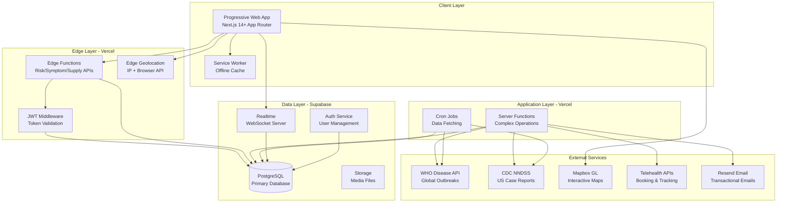
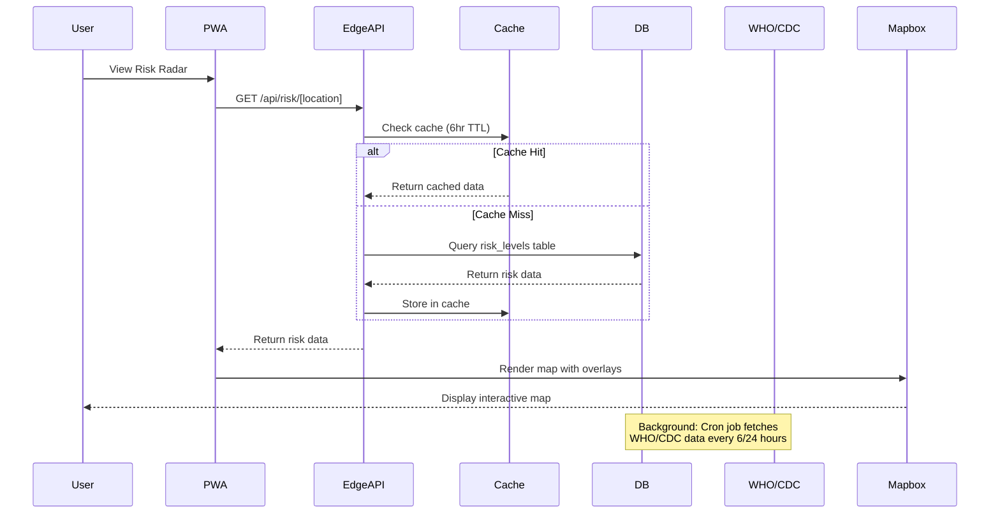
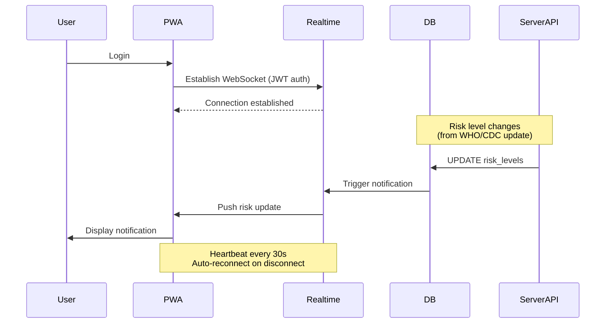
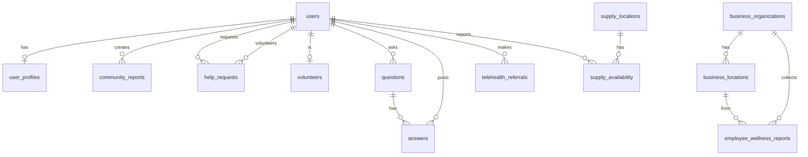
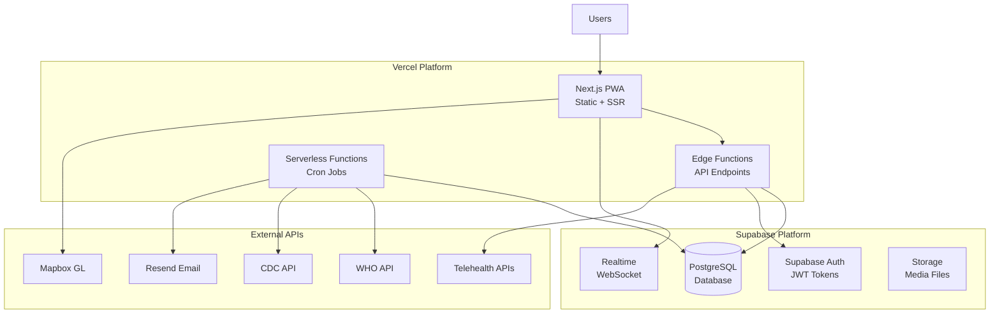
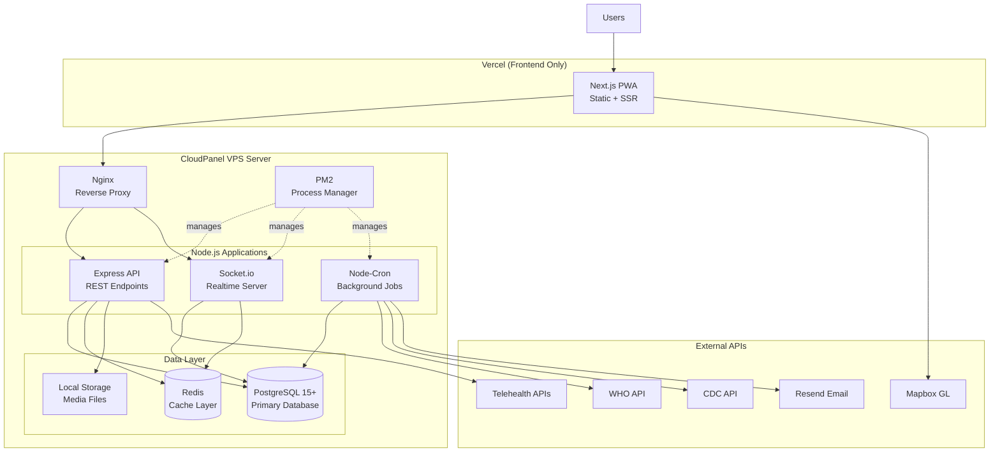

# Design Document: VigilHealth Community Platform

## Overview

The VigilHealth Community Platform is a hyperlocal health intelligence Progressive Web Application that combines real-time community safety data with actionable health resources. The platform operates as a "Waze for health risks meets Nextdoor for wellness," enabling users to make informed decisions based on real-time local data while generating revenue from day one through multiple streams (telehealth affiliates, premium listings, safe badges, B2B dashboards).

### Design Goals

1. **Zero Capital Startup**: Operate entirely on free-tier services (Vercel, Supabase, Mapbox, Resend)
2. **MVP Buildability**: Complete core features within 2-3 weeks
3. **Performance**: <2s API responses, <1s map loads, <500ms DB queries
4. **Revenue-Ready**: Support multiple revenue streams from launch
5. **Low Liability**: Provide information without practicing medicine
6. **Scalability**: Architecture supports growth beyond free tiers

### Key Technical Constraints

- **Vercel Free Tier**: 100GB bandwidth/month, 500K edge function execution units, 100 GB-Hrs function execution
- **Supabase Free Tier**: 500MB storage, 2GB bandwidth/month, 500MB database size
- **Mapbox Free Tier**: 50,000 map loads/month
- **Resend Free Tier**: 100 emails/day (3,000/month)
- **Performance Targets**: 95th percentile API response <2s, map load <1s, DB queries <500ms

## Architecture

### High-Level System Architecture

The platform follows a modern serverless architecture with edge computing for optimal performance:



### Architecture Layers

#### 1. Client Layer (Progressive Web App)

**Technology**: Next.js 14+ with App Router, React 18+, TypeScript

**Key Features**:
- Server Components for initial page loads (faster Time to First Byte)
- Client Components for interactive features (maps, real-time updates)
- Service Worker for offline caching and background sync
- Responsive design (320px - 2560px viewport width)
- Installable on iOS/Android via PWA manifest

**Offline Strategy**:
- Cache-first for static assets (CSS, JS, images)
- Network-first with cache fallback for API data
- Background sync queue for user actions (help requests, supply reports)
- IndexedDB for offline data storage

**Research Findings**: Next.js Server Components reduce JavaScript bundle size by 40-70% and improve Time to First Byte by 60-80% compared to traditional SPAs ([source](https://codewithseb.com/blog/nextjs-2026-server-components-edge-runtime-guide)). The `next-pwa` package provides zero-config PWA setup with Workbox for service worker management.

#### 2. Edge Layer (Vercel Edge Functions)

**Technology**: Vercel Edge Runtime (V8 isolates), Edge Middleware

**Edge Functions** (sub-200ms response time):
- `/api/risk/[location]` - Risk level queries
- `/api/symptom/check` - Symptom matching
- `/api/supply/search` - Supply availability search
- `/api/geo/resolve` - Geolocation resolution

**Edge Middleware**:
- JWT token validation (runs before all authenticated routes)
- Rate limiting (5 requests/second per IP)
- CORS headers
- Request logging

**Constraints**:
- 128MB memory limit per execution
- 25ms CPU time limit per request
- No filesystem access
- No native Node.js modules
- Cold start <5ms

**Research Findings**: Edge Functions run in 30+ global locations with cold starts under 5ms ([source](https://privatedevops.com/articles/nextjs-edge-functions-global-performance)). Geographic proximity of edge nodes to users significantly reduces latency for API calls.

#### 3. Application Layer (Vercel Serverless Functions)

**Technology**: Node.js 20.x runtime, Vercel Serverless Functions

**Server Functions** (for complex operations):
- `/api/data/fetch-who` - WHO API integration (cron job)
- `/api/data/fetch-cdc` - CDC NNDSS integration (cron job)
- `/api/telehealth/book` - Telehealth booking coordination
- `/api/email/digest` - Daily digest generation
- `/api/analytics/report` - Analytics aggregation

**Cron Jobs** (Vercel Cron):
- WHO data fetch: Every 6 hours (`0 */6 * * *`)
- CDC data fetch: Daily at 2 AM (`0 2 * * *`)
- Daily digest generation: Daily at 7 AM local time (staggered by timezone)
- Analytics aggregation: Daily at midnight (`0 0 * * *`)

**Constraints**:
- 10 second timeout (Hobby plan)
- 1024MB memory limit
- 250MB uncompressed deployment size

#### 4. Data Layer (Supabase)

**Technology**: PostgreSQL 15+, Supabase Realtime, Supabase Auth

**Database**: PostgreSQL with PostGIS extension for geospatial queries

**Realtime**: WebSocket server for live updates
- Risk level changes
- New outbreak alerts
- Help request notifications
- Community Q&A updates

**Authentication**: Supabase Auth with JWT tokens
- Email/password authentication
- Email verification
- Password reset
- Session management (24-hour expiry)

**Row Level Security (RLS)**: All tables protected with RLS policies
- Users can only read/write their own data
- Business users can access their organization's data
- Public data (risk levels, Q&A) accessible to all authenticated users

**Research Findings**: Supabase Realtime uses WebSocket connections authenticated via JWT tokens. RLS policies are evaluated at the database level, ensuring security even if application logic is bypassed ([source](https://supabase.com/docs/guides/realtime/authorization)). Proper indexing of foreign keys and RLS policy optimization is critical for performance ([source](https://supabase.com/docs/guides/troubleshooting/rls-performance-and-best-practices-Z5Jjwv)).

### Component Interaction Patterns

#### Risk Radar Data Flow



#### Realtime Alert Flow



## Components and Interfaces

### Frontend Components

#### Core UI Components

1. **RiskRadarMap** (Client Component)
   - Interactive Mapbox GL map with vector overlays
   - Color-coded risk levels (low/moderate/high/critical)
   - Zoom levels 10-15 (city to neighborhood)
   - Click handlers for location details
   - Offline: Display cached map tiles and last known risk data

2. **SymptomCheckerFlow** (Client Component)
   - Multi-step form for symptom input
   - Real-time matching against outbreak profiles
   - Confidence score display (0-100)
   - Telehealth referral integration
   - Emergency condition detection and warnings

3. **SupplyFinderList** (Server Component with Client interactivity)
   - Location-based search (radius: 1-50 miles)
   - Real-time availability status
   - Premium listing highlighting
   - Safe badge display
   - Navigation integration

4. **CommunityNetworkBoard** (Client Component with Realtime)
   - Help request creation and browsing
   - Volunteer matching (2-mile radius)
   - Real-time status updates via WebSocket
   - Rating and verification display

5. **CommunityQAFeed** (Server Component with Client interactivity)
   - Question submission with duplicate detection
   - Answer posting with source citation
   - Upvoting and sorting
   - Misinformation flagging

6. **BusinessDashboard** (Client Component)
   - Employee wellness aggregation charts
   - Sick-day trend visualization
   - Multi-location segmentation
   - Alert configuration

#### Shared Components

- **NotificationCenter**: Toast notifications and alert history
- **UserProfile**: Settings, preferences, location management
- **AuthForms**: Login, registration, password reset
- **OfflineIndicator**: Network status display
- **LoadingStates**: Skeleton screens and spinners

### Backend API Interfaces

#### Edge API Endpoints

**GET /api/risk/[location]**
```typescript
// Request
interface RiskRequest {
  location: string; // lat,lng or place name
  radius?: number; // miles, default 5
}

// Response
interface RiskResponse {
  location: {
    lat: number;
    lng: number;
    name: string;
  };
  riskLevel: 'low' | 'moderate' | 'high' | 'critical';
  riskScore: number; // 0-100
  sources: Array<{
    type: 'who' | 'cdc' | 'community';
    timestamp: string;
    confidence: number;
  }>;
  nearbyOutbreaks: Array<{
    disease: string;
    distance: number; // miles
    caseCount: number;
  }>;
  lastUpdated: string;
}
```

**POST /api/symptom/check**
```typescript
// Request
interface SymptomCheckRequest {
  symptoms: string[]; // e.g., ["fever", "cough", "fatigue"]
  duration: number; // days
  severity: 'mild' | 'moderate' | 'severe';
  location: string; // lat,lng
}

// Response
interface SymptomCheckResponse {
  matches: Array<{
    disease: string;
    confidence: number; // 0-100
    commonSymptoms: string[];
    recommendation: 'monitor' | 'telehealth' | 'testing' | 'emergency';
    localPrevalence: 'low' | 'moderate' | 'high';
  }>;
  telehealth: {
    available: boolean;
    providers: Array<{
      id: string;
      name: string;
      waitTime: number; // minutes
      affiliateLink: string;
    }>;
  };
  disclaimer: string;
}
```

**GET /api/supply/search**
```typescript
// Request
interface SupplySearchRequest {
  item: string; // e.g., "N95 masks"
  location: string; // lat,lng
  radius: number; // miles
  filters?: {
    inStock?: boolean;
    premiumOnly?: boolean;
    safeBadge?: boolean;
  };
}

// Response
interface SupplySearchResponse {
  results: Array<{
    id: string;
    name: string;
    type: 'pharmacy' | 'testing_site' | 'telehealth' | 'other';
    location: {
      lat: number;
      lng: number;
      address: string;
    };
    distance: number; // miles
    availability: 'in_stock' | 'low_stock' | 'out_of_stock' | 'unknown';
    lastUpdated: string;
    isPremium: boolean;
    hasSafeBadge: boolean;
    hours: string;
    contact: string;
  }>;
  total: number;
}
```

**POST /api/geo/resolve**
```typescript
// Request
interface GeoResolveRequest {
  input: string; // address, city, ZIP, or lat,lng
  type?: 'address' | 'city' | 'coordinates';
}

// Response
interface GeoResolveResponse {
  location: {
    lat: number;
    lng: number;
    name: string;
    city: string;
    state: string;
    country: string;
    zipCode?: string;
  };
  confidence: number; // 0-100
  alternatives?: Array<{
    name: string;
    lat: number;
    lng: number;
  }>;
}
```

#### Server API Endpoints

**POST /api/community/help-request**
```typescript
// Request (authenticated)
interface HelpRequestCreate {
  description: string;
  taskType: 'groceries' | 'pharmacy' | 'other';
  location: {
    lat: number;
    lng: number;
  };
  urgency: 'low' | 'medium' | 'high';
}

// Response
interface HelpRequestResponse {
  id: string;
  status: 'pending' | 'accepted' | 'fulfilled';
  createdAt: string;
  nearbyVolunteers: number;
}
```

**POST /api/community/qa/question**
```typescript
// Request (authenticated)
interface QuestionCreate {
  title: string;
  body: string;
  tags: string[];
}

// Response
interface QuestionResponse {
  id: string;
  similarQuestions: Array<{
    id: string;
    title: string;
    answerCount: number;
  }>;
  created: boolean; // false if duplicate detected
}
```

**POST /api/community/qa/answer**
```typescript
// Request (authenticated)
interface AnswerCreate {
  questionId: string;
  body: string;
  sources: Array<{
    url: string;
    title: string;
    organization: string;
  }>;
}

// Response
interface AnswerResponse {
  id: string;
  verified: boolean; // true if sources validated
  createdAt: string;
}
```

**POST /api/telehealth/book**
```typescript
// Request (authenticated)
interface TelehealthBookingRequest {
  providerId: string;
  symptomSummary: string;
  preferredTime?: string;
  userContact: {
    email: string;
    phone?: string;
  };
}

// Response
interface TelehealthBookingResponse {
  bookingId: string;
  referralId: string; // for commission tracking
  confirmationUrl: string;
  estimatedWaitTime: number; // minutes
}
```

### External Service Interfaces

#### WHO Disease API Integration

**Endpoint**: `https://www.who.int/emergencies/disease-outbreak-news/api`

**Fetch Schedule**: Every 6 hours via cron job

**Data Mapping**:
```typescript
interface WHOOutbreak {
  disease: string;
  regions: string[]; // WHO regions
  countries: string[];
  caseCount?: number;
  publishedDate: string;
  url: string;
}

// Map to internal format
interface InternalRiskData {
  source: 'who';
  disease: string;
  locations: Array<{
    country: string;
    lat: number;
    lng: number;
  }>;
  severity: 'low' | 'moderate' | 'high' | 'critical';
  caseCount: number;
  timestamp: string;
  sourceUrl: string;
}
```

**Caching Strategy**: 6-hour TTL in database, fallback to cached data if API unavailable

#### CDC NNDSS Feed Integration

**Endpoint**: `https://data.cdc.gov/resource/[dataset-id].json`

**Fetch Schedule**: Daily at 2 AM via cron job

**Data Mapping**:
```typescript
interface CDCCaseReport {
  disease: string;
  state: string;
  county?: string;
  fipsCode: string;
  caseCount: number;
  reportingWeek: string;
}

// Map to internal format with geocoding
interface InternalRiskData {
  source: 'cdc';
  disease: string;
  locations: Array<{
    state: string;
    county: string;
    fipsCode: string;
    lat: number;
    lng: number;
  }>;
  severity: 'low' | 'moderate' | 'high' | 'critical';
  caseCount: number;
  timestamp: string;
  sourceUrl: string;
}
```

**Caching Strategy**: 24-hour TTL, prioritize CDC over WHO for US locations

#### Mapbox GL Integration

**Usage**: Client-side map rendering

**API Key Management**: Public token with URL restrictions

**Tile Caching**: Service worker caches map tiles for offline use

**Free Tier Management**:
- Track map loads via analytics
- Alert at 40,000 loads (80% of 50K limit)
- Implement lazy loading (only load map when user scrolls to it)

**Vector Overlay Strategy**:
```typescript
interface RiskOverlay {
  type: 'circle' | 'heatmap';
  data: GeoJSON.FeatureCollection;
  paint: {
    'circle-color': [
      'match',
      ['get', 'riskLevel'],
      'low', '#10b981',
      'moderate', '#f59e0b',
      'high', '#ef4444',
      'critical', '#7f1d1d',
      '#gray'
    ];
    'circle-radius': 10;
    'circle-opacity': 0.7;
  };
}
```

#### Resend Email Integration

**Usage**: Transactional emails and daily digests

**Email Types**:
1. Welcome email (on registration)
2. Email verification
3. Password reset
4. Daily digest (scheduled)
5. Critical alert notifications

**Template Structure**:
```typescript
interface EmailTemplate {
  from: 'VigilHealth <alerts@vigilhealth.com>';
  to: string;
  subject: string;
  html: string; // Resend template
  tags: string[]; // for tracking
}
```

**Free Tier Management**:
- 100 emails/day limit
- Prioritize: Critical alerts > Transactional > Daily digests
- Queue overflow emails for next day
- Alert at 80 emails/day

## Data Models

### Database Schema

#### Users Table
```sql
CREATE TABLE users (
  id UUID PRIMARY KEY DEFAULT gen_random_uuid(),
  email TEXT UNIQUE NOT NULL,
  password_hash TEXT NOT NULL,
  email_verified BOOLEAN DEFAULT FALSE,
  created_at TIMESTAMPTZ DEFAULT NOW(),
  updated_at TIMESTAMPTZ DEFAULT NOW()
);

CREATE INDEX idx_users_email ON users(email);
```

#### User Profiles Table
```sql
CREATE TABLE user_profiles (
  id UUID PRIMARY KEY REFERENCES users(id) ON DELETE CASCADE,
  full_name TEXT,
  primary_location GEOGRAPHY(POINT, 4326),
  primary_city TEXT,
  primary_state TEXT,
  search_radius_miles INTEGER DEFAULT 5,
  notification_preferences JSONB DEFAULT '{"push": true, "email": true, "sms": false}'::jsonb,
  created_at TIMESTAMPTZ DEFAULT NOW(),
  updated_at TIMESTAMPTZ DEFAULT NOW()
);

CREATE INDEX idx_user_profiles_location ON user_profiles USING GIST(primary_location);
```

#### Risk Levels Table
```sql
CREATE TABLE risk_levels (
  id UUID PRIMARY KEY DEFAULT gen_random_uuid(),
  location GEOGRAPHY(POINT, 4326) NOT NULL,
  location_name TEXT NOT NULL,
  city TEXT,
  state TEXT,
  country TEXT,
  disease TEXT NOT NULL,
  risk_level TEXT CHECK (risk_level IN ('low', 'moderate', 'high', 'critical')),
  risk_score INTEGER CHECK (risk_score BETWEEN 0 AND 100),
  case_count INTEGER,
  source TEXT CHECK (source IN ('who', 'cdc', 'community')),
  source_url TEXT,
  confidence INTEGER CHECK (confidence BETWEEN 0 AND 100),
  valid_from TIMESTAMPTZ NOT NULL,
  valid_until TIMESTAMPTZ,
  created_at TIMESTAMPTZ DEFAULT NOW(),
  updated_at TIMESTAMPTZ DEFAULT NOW()
);

CREATE INDEX idx_risk_levels_location ON risk_levels USING GIST(location);
CREATE INDEX idx_risk_levels_disease ON risk_levels(disease);
CREATE INDEX idx_risk_levels_valid_from ON risk_levels(valid_from DESC);
CREATE INDEX idx_risk_levels_source ON risk_levels(source);
```

#### Community Reports Table
```sql
CREATE TABLE community_reports (
  id UUID PRIMARY KEY DEFAULT gen_random_uuid(),
  user_id UUID REFERENCES users(id) ON DELETE SET NULL,
  location GEOGRAPHY(POINT, 4326) NOT NULL,
  observation_type TEXT CHECK (observation_type IN ('symptom', 'supply', 'other')),
  description TEXT NOT NULL,
  is_flagged BOOLEAN DEFAULT FALSE,
  flag_reason TEXT,
  created_at TIMESTAMPTZ DEFAULT NOW()
);

CREATE INDEX idx_community_reports_location ON community_reports USING GIST(location);
CREATE INDEX idx_community_reports_created_at ON community_reports(created_at DESC);
CREATE INDEX idx_community_reports_flagged ON community_reports(is_flagged) WHERE is_flagged = TRUE;
```

#### Supply Locations Table
```sql
CREATE TABLE supply_locations (
  id UUID PRIMARY KEY DEFAULT gen_random_uuid(),
  name TEXT NOT NULL,
  type TEXT CHECK (type IN ('pharmacy', 'testing_site', 'telehealth', 'other')),
  location GEOGRAPHY(POINT, 4326) NOT NULL,
  address TEXT NOT NULL,
  city TEXT,
  state TEXT,
  zip_code TEXT,
  phone TEXT,
  hours TEXT,
  is_premium BOOLEAN DEFAULT FALSE,
  has_safe_badge BOOLEAN DEFAULT FALSE,
  safe_badge_expires_at TIMESTAMPTZ,
  created_at TIMESTAMPTZ DEFAULT NOW(),
  updated_at TIMESTAMPTZ DEFAULT NOW()
);

CREATE INDEX idx_supply_locations_location ON supply_locations USING GIST(location);
CREATE INDEX idx_supply_locations_type ON supply_locations(type);
CREATE INDEX idx_supply_locations_premium ON supply_locations(is_premium) WHERE is_premium = TRUE;
```

#### Supply Availability Table
```sql
CREATE TABLE supply_availability (
  id UUID PRIMARY KEY DEFAULT gen_random_uuid(),
  location_id UUID REFERENCES supply_locations(id) ON DELETE CASCADE,
  item_name TEXT NOT NULL,
  status TEXT CHECK (status IN ('in_stock', 'low_stock', 'out_of_stock', 'unknown')),
  reported_by UUID REFERENCES users(id) ON DELETE SET NULL,
  created_at TIMESTAMPTZ DEFAULT NOW()
);

CREATE INDEX idx_supply_availability_location ON supply_availability(location_id);
CREATE INDEX idx_supply_availability_item ON supply_availability(item_name);
CREATE INDEX idx_supply_availability_created_at ON supply_availability(created_at DESC);
```

#### Help Requests Table
```sql
CREATE TABLE help_requests (
  id UUID PRIMARY KEY DEFAULT gen_random_uuid(),
  requester_id UUID REFERENCES users(id) ON DELETE CASCADE,
  description TEXT NOT NULL,
  task_type TEXT CHECK (task_type IN ('groceries', 'pharmacy', 'other')),
  location GEOGRAPHY(POINT, 4326) NOT NULL,
  urgency TEXT CHECK (urgency IN ('low', 'medium', 'high')),
  status TEXT CHECK (status IN ('pending', 'accepted', 'fulfilled', 'cancelled')),
  volunteer_id UUID REFERENCES users(id) ON DELETE SET NULL,
  created_at TIMESTAMPTZ DEFAULT NOW(),
  updated_at TIMESTAMPTZ DEFAULT NOW(),
  fulfilled_at TIMESTAMPTZ
);

CREATE INDEX idx_help_requests_location ON help_requests USING GIST(location);
CREATE INDEX idx_help_requests_status ON help_requests(status) WHERE status = 'pending';
CREATE INDEX idx_help_requests_created_at ON help_requests(created_at DESC);
```

#### Volunteers Table
```sql
CREATE TABLE volunteers (
  id UUID PRIMARY KEY REFERENCES users(id) ON DELETE CASCADE,
  is_verified BOOLEAN DEFAULT FALSE,
  verification_method TEXT,
  average_rating DECIMAL(3,2),
  completed_tasks INTEGER DEFAULT 0,
  created_at TIMESTAMPTZ DEFAULT NOW(),
  updated_at TIMESTAMPTZ DEFAULT NOW()
);

CREATE INDEX idx_volunteers_verified ON volunteers(is_verified) WHERE is_verified = TRUE;
```

#### Questions Table
```sql
CREATE TABLE questions (
  id UUID PRIMARY KEY DEFAULT gen_random_uuid(),
  user_id UUID REFERENCES users(id) ON DELETE SET NULL,
  title TEXT NOT NULL,
  body TEXT NOT NULL,
  tags TEXT[],
  view_count INTEGER DEFAULT 0,
  created_at TIMESTAMPTZ DEFAULT NOW(),
  updated_at TIMESTAMPTZ DEFAULT NOW()
);

CREATE INDEX idx_questions_created_at ON questions(created_at DESC);
CREATE INDEX idx_questions_tags ON questions USING GIN(tags);
```

#### Answers Table
```sql
CREATE TABLE answers (
  id UUID PRIMARY KEY DEFAULT gen_random_uuid(),
  question_id UUID REFERENCES questions(id) ON DELETE CASCADE,
  user_id UUID REFERENCES users(id) ON DELETE SET NULL,
  body TEXT NOT NULL,
  sources JSONB NOT NULL, -- Array of {url, title, organization}
  is_verified BOOLEAN DEFAULT FALSE,
  upvotes INTEGER DEFAULT 0,
  is_flagged BOOLEAN DEFAULT FALSE,
  flag_count INTEGER DEFAULT 0,
  created_at TIMESTAMPTZ DEFAULT NOW(),
  updated_at TIMESTAMPTZ DEFAULT NOW()
);

CREATE INDEX idx_answers_question ON answers(question_id);
CREATE INDEX idx_answers_upvotes ON answers(upvotes DESC);
CREATE INDEX idx_answers_flagged ON answers(is_flagged) WHERE is_flagged = TRUE;
```

#### Business Organizations Table
```sql
CREATE TABLE business_organizations (
  id UUID PRIMARY KEY DEFAULT gen_random_uuid(),
  name TEXT NOT NULL,
  subscription_tier TEXT CHECK (subscription_tier IN ('free', 'basic', 'premium')),
  subscription_expires_at TIMESTAMPTZ,
  created_at TIMESTAMPTZ DEFAULT NOW(),
  updated_at TIMESTAMPTZ DEFAULT NOW()
);
```

#### Business Locations Table
```sql
CREATE TABLE business_locations (
  id UUID PRIMARY KEY DEFAULT gen_random_uuid(),
  organization_id UUID REFERENCES business_organizations(id) ON DELETE CASCADE,
  name TEXT NOT NULL,
  location GEOGRAPHY(POINT, 4326),
  address TEXT,
  created_at TIMESTAMPTZ DEFAULT NOW()
);

CREATE INDEX idx_business_locations_org ON business_locations(organization_id);
```

#### Employee Wellness Reports Table
```sql
CREATE TABLE employee_wellness_reports (
  id UUID PRIMARY KEY DEFAULT gen_random_uuid(),
  organization_id UUID REFERENCES business_organizations(id) ON DELETE CASCADE,
  location_id UUID REFERENCES business_locations(id) ON DELETE SET NULL,
  employee_id TEXT NOT NULL, -- Anonymized identifier
  symptoms TEXT[],
  severity TEXT CHECK (severity IN ('mild', 'moderate', 'severe')),
  is_absent BOOLEAN DEFAULT FALSE,
  reported_at TIMESTAMPTZ DEFAULT NOW()
);

CREATE INDEX idx_wellness_reports_org ON employee_wellness_reports(organization_id);
CREATE INDEX idx_wellness_reports_location ON employee_wellness_reports(location_id);
CREATE INDEX idx_wellness_reports_date ON employee_wellness_reports(reported_at DESC);
```

#### Telehealth Referrals Table
```sql
CREATE TABLE telehealth_referrals (
  id UUID PRIMARY KEY DEFAULT gen_random_uuid(),
  user_id UUID REFERENCES users(id) ON DELETE SET NULL,
  provider_id TEXT NOT NULL,
  provider_name TEXT NOT NULL,
  referral_code TEXT UNIQUE NOT NULL,
  symptom_summary TEXT,
  status TEXT CHECK (status IN ('pending', 'completed', 'cancelled')),
  commission_amount DECIMAL(10,2),
  commission_paid BOOLEAN DEFAULT FALSE,
  created_at TIMESTAMPTZ DEFAULT NOW(),
  completed_at TIMESTAMPTZ
);

CREATE INDEX idx_telehealth_referrals_user ON telehealth_referrals(user_id);
CREATE INDEX idx_telehealth_referrals_code ON telehealth_referrals(referral_code);
CREATE INDEX idx_telehealth_referrals_status ON telehealth_referrals(status);
```

### Row Level Security Policies

#### Users Table RLS
```sql
ALTER TABLE users ENABLE ROW LEVEL SECURITY;

-- Users can read their own data
CREATE POLICY users_select_own ON users
  FOR SELECT
  USING (auth.uid() = id);

-- Users can update their own data
CREATE POLICY users_update_own ON users
  FOR UPDATE
  USING (auth.uid() = id);
```

#### User Profiles RLS
```sql
ALTER TABLE user_profiles ENABLE ROW LEVEL SECURITY;

-- Users can read/update their own profile
CREATE POLICY profiles_select_own ON user_profiles
  FOR SELECT
  USING (auth.uid() = id);

CREATE POLICY profiles_update_own ON user_profiles
  FOR UPDATE
  USING (auth.uid() = id);

CREATE POLICY profiles_insert_own ON user_profiles
  FOR INSERT
  WITH CHECK (auth.uid() = id);
```

#### Risk Levels RLS
```sql
ALTER TABLE risk_levels ENABLE ROW LEVEL SECURITY;

-- All authenticated users can read risk levels
CREATE POLICY risk_levels_select_all ON risk_levels
  FOR SELECT
  TO authenticated
  USING (true);

-- Only system can insert/update (via service role)
```

#### Community Reports RLS
```sql
ALTER TABLE community_reports ENABLE ROW LEVEL SECURITY;

-- Users can read all non-flagged reports
CREATE POLICY reports_select_public ON community_reports
  FOR SELECT
  TO authenticated
  USING (is_flagged = FALSE);

-- Users can insert their own reports
CREATE POLICY reports_insert_own ON community_reports
  FOR INSERT
  TO authenticated
  WITH CHECK (auth.uid() = user_id);

-- Users can read their own flagged reports
CREATE POLICY reports_select_own_flagged ON community_reports
  FOR SELECT
  TO authenticated
  USING (auth.uid() = user_id AND is_flagged = TRUE);
```

#### Help Requests RLS
```sql
ALTER TABLE help_requests ENABLE ROW LEVEL SECURITY;

-- Users can read pending requests within 2 miles
CREATE POLICY help_requests_select_nearby ON help_requests
  FOR SELECT
  TO authenticated
  USING (
    status = 'pending' AND
    ST_DWithin(
      location,
      (SELECT primary_location FROM user_profiles WHERE id = auth.uid()),
      3218.69 -- 2 miles in meters
    )
  );

-- Users can read their own requests (any status)
CREATE POLICY help_requests_select_own ON help_requests
  FOR SELECT
  TO authenticated
  USING (auth.uid() = requester_id OR auth.uid() = volunteer_id);

-- Users can insert their own requests
CREATE POLICY help_requests_insert_own ON help_requests
  FOR INSERT
  TO authenticated
  WITH CHECK (auth.uid() = requester_id);

-- Volunteers can update requests they've accepted
CREATE POLICY help_requests_update_volunteer ON help_requests
  FOR UPDATE
  TO authenticated
  USING (auth.uid() = volunteer_id);
```

#### Business Dashboard RLS
```sql
ALTER TABLE employee_wellness_reports ENABLE ROW LEVEL SECURITY;

-- Business users can only see their organization's aggregated data
CREATE POLICY wellness_reports_select_org ON employee_wellness_reports
  FOR SELECT
  TO authenticated
  USING (
    organization_id IN (
      SELECT organization_id FROM business_users WHERE user_id = auth.uid()
    )
  );

-- Employees can insert their own reports
CREATE POLICY wellness_reports_insert_employee ON employee_wellness_reports
  FOR INSERT
  TO authenticated
  WITH CHECK (
    organization_id IN (
      SELECT organization_id FROM business_employees WHERE user_id = auth.uid()
    )
  );
```

### Data Relationships



## Hybrid Migration Strategy (Phase 1 → Phase 2)

### Overview

The platform is designed with a **phased migration approach** that starts with a fully serverless architecture (Phase 1) and transitions to a hybrid CloudPanel-hosted backend (Phase 2) as the platform scales. This strategy minimizes initial costs while maintaining a clear path to cost-effective scaling.

### Phase 1: Serverless Architecture (MVP - Weeks 1-3)

**Target**: Launch MVP with zero infrastructure costs using free tiers

**Architecture Stack**:
- **Frontend**: Vercel (Next.js PWA) - 100GB bandwidth/month
- **Database**: Supabase (managed PostgreSQL) - 500MB storage, 2GB bandwidth/month
- **Auth**: Supabase Auth - JWT-based authentication
- **Storage**: Supabase Storage - 1GB storage
- **Realtime**: Supabase Realtime - WebSocket connections
- **Edge Functions**: Vercel Edge Functions - 500K execution units/month
- **Email**: Resend (free tier) - 100 emails/day
- **Maps**: Mapbox GL (free tier) - 50,000 map loads/month

**Phase 1 Architecture Diagram**:



**Phase 1 Characteristics**:
- ✅ Zero infrastructure management
- ✅ Global CDN for frontend
- ✅ Auto-scaling
- ✅ Built-in SSL/TLS
- ✅ Fast deployment (< 1 minute)
- ⚠️ Limited by free tier quotas
- ⚠️ Vendor lock-in to Supabase
- ⚠️ Higher per-request costs at scale

**Migration Trigger Points** (when to move to Phase 2):
1. **Database**: Approaching 400MB storage (80% of 500MB limit)
2. **Bandwidth**: Approaching 1.6GB/month database bandwidth (80% of 2GB limit)
3. **API Calls**: Approaching 40K map loads/month (80% of 50K limit)
4. **Cost Analysis**: When CloudPanel hosting ($10-20/month) becomes cheaper than Supabase paid tier ($25/month)
5. **Feature Needs**: When requiring features not available in Supabase free tier (e.g., point-in-time recovery, read replicas)

### Phase 2: CloudPanel Hybrid Architecture (Growth - Month 2+)

**Target**: Reduce costs while maintaining performance and reliability

**Architecture Stack**:
- **Frontend**: STAYS on Vercel (keep global CDN benefits) - $20/month Pro plan
- **Database**: CloudPanel server (self-hosted PostgreSQL 15+) - $10-20/month VPS
- **API**: CloudPanel server (Node.js/Express) - same VPS
- **Auth**: Custom JWT implementation with bcrypt - same VPS
- **Storage**: CloudPanel server (local filesystem or S3-compatible) - same VPS
- **Realtime**: Socket.io on CloudPanel - same VPS
- **Caching**: Redis on CloudPanel - same VPS
- **Reverse Proxy**: Nginx on CloudPanel - included
- **Process Manager**: PM2 on CloudPanel - included
- **External APIs**: KEEP Mapbox, Resend, WHO, CDC, Telehealth (no change)

**Phase 2 Architecture Diagram**:



**Phase 2 Characteristics**:
- ✅ Predictable monthly costs ($30-40 total vs $100+ on paid tiers)
- ✅ Full control over infrastructure
- ✅ No vendor lock-in
- ✅ Unlimited database size (limited by VPS disk)
- ✅ Custom optimizations possible
- ⚠️ Requires infrastructure management
- ⚠️ Manual scaling (vertical: upgrade VPS, horizontal: add servers)
- ⚠️ Responsible for backups and monitoring

**Why Frontend Stays on Vercel**:
1. **Global CDN**: 300+ edge locations worldwide (impossible to replicate cost-effectively)
2. **Automatic SSL**: Free SSL certificates with auto-renewal
3. **Zero-config deployments**: Git push → live in 30 seconds
4. **Edge caching**: Static assets cached globally
5. **DDoS protection**: Built-in protection at CDN level
6. **Cost-effective**: $20/month Pro plan sufficient for 1TB bandwidth

### Migration Architecture Principles

#### 1. Database-Agnostic Design

**Principle**: Use standard PostgreSQL features only, avoid Supabase-specific extensions

**Implementation**:
```typescript
// ✅ GOOD: Standard PostgreSQL with PostGIS
CREATE EXTENSION IF NOT EXISTS postgis;

SELECT 
  id, name, 
  ST_Distance(location, ST_MakePoint($1, $2)::geography) as distance
FROM supply_locations
WHERE ST_DWithin(location, ST_MakePoint($1, $2)::geography, $3)
ORDER BY distance;

// ❌ AVOID: Supabase-specific functions
SELECT * FROM supabase.realtime.messages;
```

**Migration Impact**: Zero changes needed - same SQL works on both platforms

#### 2. API Abstraction Layer

**Principle**: Business logic separate from deployment platform

**Phase 1 Implementation** (Vercel Edge Function):
```typescript
// app/api/risk/[location]/route.ts
import { NextRequest, NextResponse } from 'next/server';
import { getRiskData } from '@/lib/services/risk-service';

export const runtime = 'edge';

export async function GET(
  request: NextRequest,
  { params }: { params: { location: string } }
) {
  const riskData = await getRiskData(params.location);
  return NextResponse.json(riskData);
}
```

**Phase 2 Implementation** (Express on CloudPanel):
```typescript
// server/routes/risk.ts
import express from 'express';
import { getRiskData } from '../services/risk-service';

const router = express.Router();

router.get('/risk/:location', async (req, res) => {
  const riskData = await getRiskData(req.params.location);
  res.json(riskData);
});

export default router;
```

**Shared Business Logic** (no changes needed):
```typescript
// lib/services/risk-service.ts
export async function getRiskData(location: string) {
  // Same logic works in both Phase 1 and Phase 2
  const db = getDatabase(); // Abstracted connection
  const result = await db.query(
    'SELECT * FROM risk_levels WHERE location_name = $1',
    [location]
  );
  return processRiskData(result.rows);
}
```

**Migration Impact**: Only routing layer changes, business logic unchanged

#### 3. Environment-Based Configuration

**Principle**: Change config, not code, to switch platforms

**Configuration File**:
```typescript
// config/database.ts
export const dbConfig = {
  // Phase 1: Supabase connection
  phase1: {
    host: process.env.SUPABASE_DB_HOST,
    port: 5432,
    database: 'postgres',
    user: 'postgres',
    password: process.env.SUPABASE_DB_PASSWORD,
    ssl: { rejectUnauthorized: false }
  },
  
  // Phase 2: CloudPanel connection
  phase2: {
    host: process.env.CLOUDPANEL_DB_HOST,
    port: 5432,
    database: 'vigilhealth',
    user: 'vigilhealth_user',
    password: process.env.CLOUDPANEL_DB_PASSWORD,
    ssl: false // Local network
  }
};

// Auto-select based on environment
export const activeConfig = process.env.DEPLOYMENT_PHASE === 'phase2' 
  ? dbConfig.phase2 
  : dbConfig.phase1;
```

**Frontend API Configuration**:
```typescript
// config/api.ts
export const apiConfig = {
  // Phase 1: Vercel Edge Functions
  phase1: {
    baseUrl: 'https://vigilhealth.vercel.app/api',
    wsUrl: 'wss://[project-ref].supabase.co/realtime/v1'
  },
  
  // Phase 2: CloudPanel API
  phase2: {
    baseUrl: 'https://api.vigilhealth.com',
    wsUrl: 'wss://api.vigilhealth.com/socket'
  }
};

export const activeApiConfig = process.env.NEXT_PUBLIC_DEPLOYMENT_PHASE === 'phase2'
  ? apiConfig.phase2
  : apiConfig.phase1;
```

**Migration Impact**: Update environment variables, redeploy frontend

#### 4. Stateless Services

**Principle**: No server-side session state, easy to replicate

**Implementation**:
- JWT tokens for authentication (stateless)
- Redis for caching (can be replicated)
- Database for persistent state (can be migrated)
- No in-memory session stores
- No file-based sessions

**Migration Impact**: Services can be stopped and started on new platform without state loss

### Step-by-Step Migration Guide

#### Pre-Migration Checklist

- [ ] CloudPanel VPS provisioned (minimum 2GB RAM, 2 CPU cores, 50GB SSD)
- [ ] Domain DNS configured (api.vigilhealth.com → CloudPanel IP)
- [ ] SSL certificate obtained (Let's Encrypt via CloudPanel)
- [ ] PostgreSQL 15+ installed on CloudPanel
- [ ] Redis installed on CloudPanel
- [ ] Node.js 20+ installed on CloudPanel
- [ ] PM2 installed globally
- [ ] Nginx configured as reverse proxy
- [ ] Backup of Supabase database taken

#### Migration Steps

**Step 1: Database Migration** (Estimated time: 2-4 hours)

1. **Export Supabase Database**:
```bash
# Using Supabase CLI
supabase db dump -f backup.sql

# Or using pg_dump directly
pg_dump -h db.[project-ref].supabase.co \
  -U postgres \
  -d postgres \
  --clean --if-exists \
  > supabase_backup.sql
```

2. **Prepare CloudPanel PostgreSQL**:
```bash
# SSH into CloudPanel VPS
ssh root@your-cloudpanel-server

# Create database and user
sudo -u postgres psql
CREATE DATABASE vigilhealth;
CREATE USER vigilhealth_user WITH ENCRYPTED PASSWORD 'secure_password';
GRANT ALL PRIVILEGES ON DATABASE vigilhealth TO vigilhealth_user;
\q

# Enable PostGIS extension
sudo -u postgres psql -d vigilhealth
CREATE EXTENSION IF NOT EXISTS postgis;
\q
```

3. **Import Data**:
```bash
# Transfer backup file to CloudPanel
scp supabase_backup.sql root@your-cloudpanel-server:/tmp/

# Import data
sudo -u postgres psql -d vigilhealth < /tmp/supabase_backup.sql

# Verify data
sudo -u postgres psql -d vigilhealth
SELECT COUNT(*) FROM users;
SELECT COUNT(*) FROM risk_levels;
\q
```

4. **Update Row Level Security** (if needed):
```sql
-- Supabase uses auth.uid() function
-- Replace with custom function for CloudPanel
CREATE OR REPLACE FUNCTION auth.uid() RETURNS UUID AS $$
  SELECT NULLIF(current_setting('request.jwt.claim.sub', true), '')::UUID;
$$ LANGUAGE SQL STABLE;
```

**Step 2: API Migration** (Estimated time: 4-6 hours)

1. **Deploy Express API to CloudPanel**:
```bash
# On CloudPanel VPS
cd /home/vigilhealth
git clone https://github.com/your-org/vigilhealth-api.git
cd vigilhealth-api

# Install dependencies
npm install --production

# Create .env file
cat > .env << EOF
NODE_ENV=production
PORT=3001
DATABASE_HOST=localhost
DATABASE_PORT=5432
DATABASE_NAME=vigilhealth
DATABASE_USER=vigilhealth_user
DATABASE_PASSWORD=secure_password
JWT_SECRET=your_jwt_secret_key
REDIS_URL=redis://localhost:6379
WHO_API_URL=https://www.who.int/emergencies/disease-outbreak-news/api
CDC_API_URL=https://data.cdc.gov/resource/[dataset-id].json
RESEND_API_KEY=your_resend_api_key
EOF

# Start with PM2
pm2 start npm --name "vigilhealth-api" -- start
pm2 save
pm2 startup
```

2. **Configure Nginx Reverse Proxy**:
```nginx
# /etc/nginx/sites-available/api.vigilhealth.com
server {
    listen 80;
    server_name api.vigilhealth.com;
    
    # Redirect HTTP to HTTPS
    return 301 https://$server_name$request_uri;
}

server {
    listen 443 ssl http2;
    server_name api.vigilhealth.com;
    
    ssl_certificate /etc/letsencrypt/live/api.vigilhealth.com/fullchain.pem;
    ssl_certificate_key /etc/letsencrypt/live/api.vigilhealth.com/privkey.pem;
    
    # Security headers
    add_header X-Frame-Options "SAMEORIGIN" always;
    add_header X-Content-Type-Options "nosniff" always;
    add_header X-XSS-Protection "1; mode=block" always;
    
    # Rate limiting
    limit_req_zone $binary_remote_addr zone=api_limit:10m rate=10r/s;
    limit_req zone=api_limit burst=20 nodelay;
    
    location / {
        proxy_pass http://localhost:3001;
        proxy_http_version 1.1;
        proxy_set_header Upgrade $http_upgrade;
        proxy_set_header Connection 'upgrade';
        proxy_set_header Host $host;
        proxy_set_header X-Real-IP $remote_addr;
        proxy_set_header X-Forwarded-For $proxy_add_x_forwarded_for;
        proxy_set_header X-Forwarded-Proto $scheme;
        proxy_cache_bypass $http_upgrade;
    }
    
    # WebSocket support for Socket.io
    location /socket.io/ {
        proxy_pass http://localhost:3002;
        proxy_http_version 1.1;
        proxy_set_header Upgrade $http_upgrade;
        proxy_set_header Connection "upgrade";
        proxy_set_header Host $host;
        proxy_set_header X-Real-IP $remote_addr;
    }
}
```

3. **Enable Nginx Configuration**:
```bash
ln -s /etc/nginx/sites-available/api.vigilhealth.com /etc/nginx/sites-enabled/
nginx -t
systemctl reload nginx
```

**Step 3: Authentication Migration** (Estimated time: 2-3 hours)

1. **Implement Custom JWT Auth**:
```typescript
// server/middleware/auth.ts
import jwt from 'jsonwebtoken';
import bcrypt from 'bcrypt';

export async function generateToken(userId: string): Promise<string> {
  return jwt.sign(
    { sub: userId, iat: Date.now() },
    process.env.JWT_SECRET!,
    { expiresIn: '24h' }
  );
}

export async function verifyToken(token: string): Promise<string | null> {
  try {
    const decoded = jwt.verify(token, process.env.JWT_SECRET!) as { sub: string };
    return decoded.sub;
  } catch {
    return null;
  }
}

export async function hashPassword(password: string): Promise<string> {
  return bcrypt.hash(password, 10);
}

export async function comparePassword(password: string, hash: string): Promise<boolean> {
  return bcrypt.compare(password, hash);
}
```

2. **Migrate User Sessions**:
```typescript
// No migration needed - JWT tokens remain valid
// Users will be seamlessly transitioned
// Old Supabase JWT tokens will expire naturally (24h)
// New logins will receive CloudPanel JWT tokens
```

**Step 4: Realtime Migration** (Estimated time: 3-4 hours)

1. **Deploy Socket.io Server**:
```typescript
// server/realtime.ts
import { Server } from 'socket.io';
import { createServer } from 'http';
import { verifyToken } from './middleware/auth';

const httpServer = createServer();
const io = new Server(httpServer, {
  cors: {
    origin: process.env.FRONTEND_URL,
    credentials: true
  }
});

// Authentication middleware
io.use(async (socket, next) => {
  const token = socket.handshake.auth.token;
  const userId = await verifyToken(token);
  
  if (!userId) {
    return next(new Error('Authentication failed'));
  }
  
  socket.data.userId = userId;
  next();
});

// Risk level updates
io.on('connection', (socket) => {
  console.log('Client connected:', socket.data.userId);
  
  socket.on('subscribe:risk', (location) => {
    socket.join(`risk:${location}`);
  });
  
  socket.on('disconnect', () => {
    console.log('Client disconnected:', socket.data.userId);
  });
});

// Broadcast risk updates
export function broadcastRiskUpdate(location: string, data: any) {
  io.to(`risk:${location}`).emit('risk:update', data);
}

httpServer.listen(3002);
```

2. **Start Socket.io with PM2**:
```bash
pm2 start npm --name "vigilhealth-realtime" -- run start:realtime
pm2 save
```

**Step 5: Frontend Configuration Update** (Estimated time: 1 hour)

1. **Update Environment Variables** (Vercel Dashboard):
```bash
NEXT_PUBLIC_DEPLOYMENT_PHASE=phase2
NEXT_PUBLIC_API_URL=https://api.vigilhealth.com
NEXT_PUBLIC_WS_URL=wss://api.vigilhealth.com
```

2. **Deploy Frontend**:
```bash
# Trigger Vercel deployment
git commit --allow-empty -m "Switch to Phase 2 architecture"
git push origin main
```

3. **Verify Frontend Connectivity**:
- Test API calls to CloudPanel
- Test WebSocket connections
- Test authentication flow
- Test real-time updates

**Step 6: Data Synchronization** (During migration window)

1. **Enable Read-Only Mode on Supabase** (optional):
```sql
-- Prevent writes during final sync
REVOKE INSERT, UPDATE, DELETE ON ALL TABLES IN SCHEMA public FROM authenticated;
```

2. **Final Data Sync**:
```bash
# Export only new data since initial migration
pg_dump -h db.[project-ref].supabase.co \
  -U postgres \
  -d postgres \
  --data-only \
  --inserts \
  > final_sync.sql

# Import to CloudPanel
sudo -u postgres psql -d vigilhealth < final_sync.sql
```

3. **Verify Data Integrity**:
```sql
-- Compare row counts
SELECT 'users' as table_name, COUNT(*) FROM users
UNION ALL
SELECT 'risk_levels', COUNT(*) FROM risk_levels
UNION ALL
SELECT 'community_reports', COUNT(*) FROM community_reports;
```

**Step 7: Cutover** (Estimated time: 30 minutes)

1. **Update DNS** (if using custom domain):
```bash
# Point api.vigilhealth.com to CloudPanel IP
# TTL should be set low (300s) before migration
```

2. **Monitor Logs**:
```bash
# API logs
pm2 logs vigilhealth-api

# Realtime logs
pm2 logs vigilhealth-realtime

# Nginx logs
tail -f /var/log/nginx/access.log
tail -f /var/log/nginx/error.log

# PostgreSQL logs
tail -f /var/log/postgresql/postgresql-15-main.log
```

3. **Verify All Systems**:
- [ ] API endpoints responding
- [ ] WebSocket connections working
- [ ] Authentication working
- [ ] Database queries executing
- [ ] Real-time updates broadcasting
- [ ] Cron jobs running
- [ ] Email sending working

**Step 8: Rollback Procedure** (if needed)

1. **Revert Frontend Environment Variables**:
```bash
NEXT_PUBLIC_DEPLOYMENT_PHASE=phase1
NEXT_PUBLIC_API_URL=https://vigilhealth.vercel.app/api
NEXT_PUBLIC_WS_URL=wss://[project-ref].supabase.co/realtime/v1
```

2. **Redeploy Frontend**:
```bash
git revert HEAD
git push origin main
```

3. **Re-enable Supabase Writes**:
```sql
GRANT INSERT, UPDATE, DELETE ON ALL TABLES IN SCHEMA public TO authenticated;
```

4. **Sync Data Back** (if any writes occurred on CloudPanel):
```bash
# Export CloudPanel data
pg_dump -h localhost -U vigilhealth_user -d vigilhealth > rollback_sync.sql

# Import to Supabase
psql -h db.[project-ref].supabase.co -U postgres -d postgres < rollback_sync.sql
```

### Post-Migration Optimization

#### 1. Database Performance Tuning

```sql
-- Analyze tables for query optimization
ANALYZE users;
ANALYZE risk_levels;
ANALYZE community_reports;

-- Create additional indexes based on query patterns
CREATE INDEX CONCURRENTLY idx_risk_levels_composite 
ON risk_levels(disease, risk_level, valid_from DESC);

-- Configure PostgreSQL for VPS resources
-- Edit /etc/postgresql/15/main/postgresql.conf
shared_buffers = 512MB  -- 25% of RAM for 2GB VPS
effective_cache_size = 1536MB  -- 75% of RAM
maintenance_work_mem = 128MB
checkpoint_completion_target = 0.9
wal_buffers = 16MB
default_statistics_target = 100
random_page_cost = 1.1  -- For SSD
effective_io_concurrency = 200
work_mem = 4MB
min_wal_size = 1GB
max_wal_size = 4GB
```

#### 2. Redis Caching Strategy

```typescript
// server/cache/redis-client.ts
import Redis from 'ioredis';

const redis = new Redis(process.env.REDIS_URL);

// Cache risk levels (6-hour TTL)
export async function cacheRiskLevel(location: string, data: any) {
  await redis.setex(`risk:${location}`, 21600, JSON.stringify(data));
}

export async function getCachedRiskLevel(location: string) {
  const cached = await redis.get(`risk:${location}`);
  return cached ? JSON.parse(cached) : null;
}

// Cache supply searches (1-hour TTL)
export async function cacheSupplySearch(key: string, data: any) {
  await redis.setex(`supply:${key}`, 3600, JSON.stringify(data));
}

// Cache geocoding results (24-hour TTL)
export async function cacheGeocode(address: string, data: any) {
  await redis.setex(`geo:${address}`, 86400, JSON.stringify(data));
}
```

#### 3. Monitoring Setup

```bash
# Install monitoring tools
npm install -g pm2-logrotate
pm2 install pm2-logrotate

# Configure log rotation
pm2 set pm2-logrotate:max_size 10M
pm2 set pm2-logrotate:retain 7
pm2 set pm2-logrotate:compress true

# Setup health check endpoint
# server/routes/health.ts
router.get('/health', async (req, res) => {
  const dbHealth = await checkDatabaseHealth();
  const redisHealth = await checkRedisHealth();
  
  res.json({
    status: dbHealth && redisHealth ? 'healthy' : 'degraded',
    database: dbHealth ? 'up' : 'down',
    redis: redisHealth ? 'up' : 'down',
    uptime: process.uptime(),
    memory: process.memoryUsage()
  });
});
```

#### 4. Backup Strategy

```bash
# Create backup script
cat > /home/vigilhealth/backup.sh << 'EOF'
#!/bin/bash
BACKUP_DIR="/home/vigilhealth/backups"
DATE=$(date +%Y%m%d_%H%M%S)

# Database backup
sudo -u postgres pg_dump vigilhealth | gzip > "$BACKUP_DIR/db_$DATE.sql.gz"

# Keep only last 7 days of backups
find "$BACKUP_DIR" -name "db_*.sql.gz" -mtime +7 -delete

# Upload to S3 (optional)
# aws s3 cp "$BACKUP_DIR/db_$DATE.sql.gz" s3://vigilhealth-backups/
EOF

chmod +x /home/vigilhealth/backup.sh

# Schedule daily backups
crontab -e
# Add: 0 3 * * * /home/vigilhealth/backup.sh
```

### Cost Comparison

#### Phase 1 (Serverless) Costs

**Free Tier** (Months 1-2):
- Vercel: $0 (100GB bandwidth)
- Supabase: $0 (500MB DB, 2GB bandwidth)
- Mapbox: $0 (50K map loads)
- Resend: $0 (100 emails/day)
- **Total: $0/month**

**Paid Tier** (After scaling):
- Vercel Pro: $20/month (1TB bandwidth)
- Supabase Pro: $25/month (8GB DB, 50GB bandwidth)
- Mapbox: $0-5/month (50K-100K loads)
- Resend: $0-10/month (100-1000 emails/day)
- **Total: $45-60/month**

#### Phase 2 (CloudPanel) Costs

**Infrastructure**:
- CloudPanel VPS (2GB RAM, 2 CPU, 50GB SSD): $10-20/month
- Vercel Pro (frontend only): $20/month
- Mapbox: $0-5/month (same)
- Resend: $0-10/month (same)
- **Total: $30-55/month**

**Cost Savings**: $15-25/month (25-40% reduction)

**Additional Benefits**:
- Unlimited database size (limited by VPS disk)
- Unlimited API calls (no per-request charges)
- Full control over infrastructure
- Ability to optimize for specific workload

### Migration Decision Matrix

| Metric | Stay Phase 1 | Migrate to Phase 2 |
|--------|--------------|-------------------|
| Monthly Active Users | < 1,000 | > 1,000 |
| Database Size | < 400MB | > 400MB |
| API Requests/Month | < 1M | > 1M |
| Monthly Cost | < $50 | > $50 |
| Team Size | 1-2 developers | 2+ developers |
| Infrastructure Skills | Limited | Moderate-Advanced |
| Customization Needs | Low | High |

## Correctness Properties

*A property is a characteristic or behavior that should hold true across all valid executions of a system—essentially, a formal statement about what the system should do. Properties serve as the bridge between human-readable specifications and machine-verifiable correctness guarantees.*

### Property-Based Testing Applicability Assessment

This platform involves multiple components with varying suitability for property-based testing (PBT):

**PBT IS Appropriate For**:
- Data parsing and formatting (WHO/CDC API responses)
- Distance calculations (geospatial queries)
- Risk level calculations and aggregations
- JWT token generation and validation
- Data serialization/deserialization
- Input validation and sanitization

**PBT IS NOT Appropriate For**:
- UI rendering and layout (use snapshot tests)
- External API integrations (use integration tests with mocks)
- Database schema migrations (use migration tests)
- Email template rendering (use snapshot tests)
- WebSocket connection management (use integration tests)

Given the significant amount of business logic involving data transformations, calculations, and validation, **PBT IS applicable** to this platform. I will now perform prework analysis on the acceptance criteria to identify testable properties.
